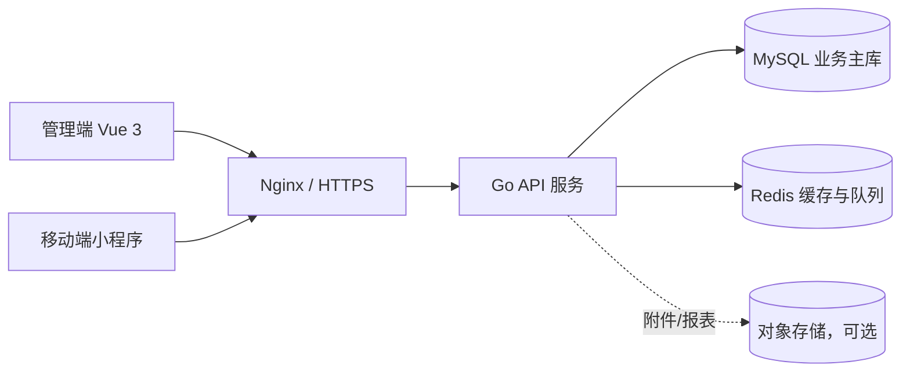

# 航空保障智能协同平台架构设计（Legacy）

> 文档状态：LEGACY / PAUSED（目标架构 v1.0 历史草案）
> 当前规范：请以 [`memory-bank/design-document.md`](design-document.md)、[`docs/architecture/architecture-v2.md`](../docs/architecture/architecture-v2.md) 和 [`memory-bank/business-slice-v2-flight-task.md`](business-slice-v2-flight-task.md) 为准。
> 本文仅保留历史背景，不再作为实现或维护依据；其中单一 API/单一数据库、AutoMigrate、机场/租户范围等描述均已过时。

## 1. 架构结论

平台采用 **模块化单体（Modular Monolith）+ 业务模块内分层**：

- Go 服务以一个进程、一个可执行文件部署，首期不拆微服务。
- 每个业务模块内部拥有自己的 Handler、Service、Repository 和领域模型。
- 前端只通过 HTTP/JSON 和 WebSocket 与 Go 服务通信，不直接访问 MySQL 或 Redis。
- MySQL 是业务事实来源；Redis 只保存缓存、短期状态和队列数据。
- 权限采用 RBAC + 数据范围控制，认证使用 JWT，授权必须在服务端完成。
- 所有公开接口从 `/api/v1` 开始版本化，接口契约统一维护在 `api/openapi.yaml`。

选择这个架构是为了保持个人/小团队开发的简单性，同时给航班、任务、事件、人员等业务模块留下清晰边界，未来可以按模块拆分服务。

## 2. 总体结构



一次普通请求的代码流向：

```text
HTTP Handler
    -> Application Service / UseCase
    -> Domain 规则与状态机
    -> Repository 接口
    -> MySQL / Redis 适配器
```

业务模块之间不要互相直接操作数据库。需要协作时，优先使用模块公开的接口；跨模块的异步通知使用领域事件或事件总线。

## 3. 目标目录

```text
flight-collaboration-platform/
├── cmd/
│   └── server/
│       └── main.go                 # 进程入口，只负责启动和退出
├── internal/
│   ├── app/
│   │   └── app.go                 # 依赖装配、生命周期、优雅关闭
│   ├── transport/
│   │   └── http/
│   │       ├── router.go           # 路由注册
│   │       ├── response.go         # HTTP 响应封装
│   │       └── middleware/         # 认证、授权、日志、恢复、CORS
│   ├── module/
│   │   ├── auth/                   # 登录、刷新、用户和角色
│   │   ├── flight/                 # 航班计划与运行状态
│   │   ├── task/                   # 任务模板、实例、分配和状态机
│   │   ├── personnel/              # 人员状态、岗位和能力
│   │   ├── event/                  # 事件、影响分析、处理闭环
│   │   ├── rule/                   # 规则、阈值和规则命中
│   │   ├── analytics/              # 运行、事件、资源和趋势分析
│   │   ├── device/                 # 设备状态上报
│   │   ├── prediction/             # AI 预测接口桩
│   │   └── notification/           # 站内、企业微信、短信等通道
│   ├── platform/
│   │   ├── config/                 # 环境变量和配置解析
│   │   ├── logger/                 # zap 日志初始化
│   │   ├── mysql/                  # GORM 连接、事务和仓储实现
│   │   ├── redis/                  # Redis 连接、缓存和队列客户端
│   │   └── clock/                  # 可测试的时间抽象
│   └── shared/
│       ├── errors/                 # 公共错误码
│       ├── pagination/             # 分页参数和结果
│       └── id/                     # ID 生成和解析
├── api/
│   └── openapi.yaml                # 前后端共同的接口契约
├── configs/
│   ├── config.example.yaml         # 可提交的示例配置
│   └── config.local.yaml           # 本地配置，不提交
├── migrations/                     # 数据库版本迁移
├── deployments/
│   ├── docker-compose.yml
│   └── Dockerfile
├── web-admin/                      # Vue 3 管理端
├── miniapp/                        # 微信小程序
├── docs/                           # 产品、接口和部署说明
└── memory-bank/                    # 长期架构与实施记录
```

### 3.1 业务模块内部约定

以 `flight` 为例：

```text
internal/module/flight/
├── handler.go                      # Gin 参数解析、鉴权上下文、响应转换
├── service.go                      # 用例编排和事务边界
├── repository.go                   # 由业务需要定义的仓储接口
├── model.go                        # 航班领域模型和状态规则
├── dto.go                          # API 输入/输出结构
└── mysql_repository.go             # 小模块可先放这里；变大后移到 adapter/mysql
```

约束：

- Handler 不得直接调用 GORM、Redis 或拼接 SQL。
- Service 不得依赖 Gin 的 `*gin.Context`。
- Domain 不得导入 Gin、GORM、Redis 等外部适配器。
- Repository 接口放在使用它的业务模块一侧，具体实现放在 MySQL 适配器一侧。
- 不建立全局的 `controllers/`、`services/`、`repositories/` 大目录，避免不同业务模块互相混杂。
- `shared/` 只能放真正通用的能力，不能成为业务代码垃圾桶。

## 4. 模块边界和依赖

### 4.1 核心模块

| 模块 | 职责 | 主要数据 |
|---|---|---|
| auth | 登录、刷新、用户、角色、权限、数据范围 | users、roles、permissions |
| flight | 航班录入、查询、状态和航班变化 | flights |
| task | 任务模板、任务实例、分配、超时和状态流转 | task_templates、task_instances、assignments |
| personnel | 人员、岗位、能力和实时状态 | personnel、positions、personnel_status |
| event | 事件产生、影响分析、认领、处理、关闭和复盘 | events、event_handles |
| rule | 规则定义、阈值、启停和规则命中 | rules、rule_hits |
| analytics | 统计汇总、运行分析、事件分析和资源分析 | *_statistics |
| device | RFID、工牌等设备状态上报入口 | device_records |
| notification | 站内、企业微信、短信等推送通道 | notifications、delivery_logs |
| prediction | AI 预测接口预留，首期固定返回未启用 | prediction_requests |

### 4.2 依赖方向

```text
transport/http -> module/* -> platform/*
                         -> shared/*

module/event  --领域事件--> module/notification
module/flight --公开接口--> module/task
module/task   --公开接口--> module/personnel
```

模块之间禁止通过对方的 GORM Model 或数据库表直接耦合。跨模块读取要么调用对方的查询接口，要么使用明确的集成事件。

## 5. 权限设计

### 5.1 认证

1. 用户通过 `POST /api/v1/auth/login` 登录。
2. 服务验证密码哈希，签发短期 Access Token 和可撤销 Refresh Token。
3. 前端在请求头中携带 `Authorization: Bearer <access_token>`。
4. JWT 只放用户 ID、会话 ID、签发时间、过期时间等身份信息，不把完整权限列表永久写入 Token。
5. 服务端每次请求执行认证、权限和数据范围检查；角色变化可以立即生效。

### 5.2 角色

| 角色 | 主要能力 | 默认数据范围 |
|---|---|---|
| `system_admin` | 用户、角色、岗位、任务库、规则和系统配置 | 全部机场/区域 |
| `duty_manager` | 查看运行态势、风险航班、事件和分析 | 所属机场/区域 |
| `team_leader` | 管理本班组人员、任务分配和异常处理 | 所属班组及负责航班 |
| `frontline` | 查看并执行本人相关任务、上报事件 | 本人和被分配航班 |
| `analyst` | 查看运行、事件和资源分析 | 授权机场/区域，只读 |
| `device_client` | 设备状态上报 | 设备所属区域，仅允许上报 |

角色只是权限集合，不能代替数据范围。相同的 `flight:read` 权限，在值班经理和一线人员身上的可见数据不同。

### 5.3 权限命名

统一使用 `resource:action`：

```text
flight:read
flight:create
flight:update
task:read
task:assign
task:complete
event:read
event:handle
event:close
personnel:read
personnel:manage
rule:manage
analytics:read
user:manage
device:report
```

### 5.4 数据范围

支持以下范围类型：

- `global`：全量数据
- `airport`：指定机场
- `area`：指定区域、航站楼或运行单元
- `team`：指定班组
- `assigned_flights`：用户被分配的航班
- `self`：仅本人数据

授权流程：

```text
Auth Middleware
    -> 识别用户
Permission Middleware
    -> 检查 resource:action
Scope Resolver
    -> 生成 SQL 条件或业务过滤器
Service
    -> 使用带范围的查询
```

不能只在前端隐藏按钮。前端按钮隐藏只是体验控制，真正的权限必须在 API 和 Service 层再次检查。

### 5.5 权限相关表

```text
users
roles
permissions
user_roles
role_permissions
user_scopes
teams
team_members
audit_logs
refresh_sessions
```

可以使用 Casbin 作为授权实现，但业务模块只依赖自己的 `Authorizer` 接口，不直接把 Casbin 类型传播到 Domain 和 Service。

## 6. 接口设计

### 6.1 通用规范

- Base URL：`/api/v1`
- 数据格式：JSON，字符集 UTF-8
- 时间：ISO 8601，服务端统一保存 UTC，前端按机场时区展示
- ID：资源 ID 使用 UUID；航班号、员工号等业务编号不是主键
- 分页：`page`、`page_size`，默认 `page_size=20`，上限 100
- 排序：只允许白名单字段，禁止直接拼接用户输入
- 请求追踪：响应返回 `requestId`
- 写操作支持 `Idempotency-Key`，尤其是设备上报和事件创建

### 6.2 统一响应

成功：

```json
{
  "code": "OK",
  "message": "success",
  "data": {},
  "requestId": "req_01..."
}
```

分页：

```json
{
  "code": "OK",
  "message": "success",
  "data": {
    "items": [],
    "page": 1,
    "pageSize": 20,
    "total": 0
  },
  "requestId": "req_01..."
}
```

失败：

```json
{
  "code": "TASK_ASSIGN_CONFLICT",
  "message": "人员存在时间冲突",
  "details": {
    "userId": "...",
    "conflictTaskId": "..."
  },
  "requestId": "req_01..."
}
```

HTTP 状态码约定：

| 状态码 | 使用场景 |
|---|---|
| 200 | 查询或更新成功 |
| 201 | 创建成功 |
| 204 | 删除或无响应体成功 |
| 400 | 参数格式错误 |
| 401 | 未认证或 Token 失效 |
| 403 | 已认证但无权限或超出数据范围 |
| 404 | 资源不存在 |
| 409 | 状态冲突、重复操作或幂等冲突 |
| 422 | 业务校验失败 |
| 500 | 未预期服务错误 |

### 6.3 首期接口清单

#### 认证和用户

```text
POST   /api/v1/auth/login
POST   /api/v1/auth/refresh
POST   /api/v1/auth/logout
GET    /api/v1/auth/me
GET    /api/v1/users
POST   /api/v1/users
PATCH  /api/v1/users/{id}
GET    /api/v1/roles
```

#### 航班

```text
GET    /api/v1/flights
POST   /api/v1/flights
GET    /api/v1/flights/{id}
PATCH  /api/v1/flights/{id}
POST   /api/v1/flights/{id}/status
GET    /api/v1/flights/{id}/timeline
```

#### 任务

```text
GET    /api/v1/task-templates
POST   /api/v1/task-templates
GET    /api/v1/tasks
POST   /api/v1/flights/{flightId}/tasks/generate
POST   /api/v1/tasks/{id}/assign
POST   /api/v1/tasks/{id}/accept
POST   /api/v1/tasks/{id}/complete
POST   /api/v1/tasks/{id}/cancel
```

#### 人员和事件

```text
GET    /api/v1/personnel
GET    /api/v1/personnel/{id}/status
POST   /api/v1/personnel/{id}/status
GET    /api/v1/events
POST   /api/v1/events
POST   /api/v1/events/{id}/claim
POST   /api/v1/events/{id}/handle
POST   /api/v1/events/{id}/close
```

#### 规则、设备和分析

```text
GET    /api/v1/rules
POST   /api/v1/rules
PATCH  /api/v1/rules/{id}/enabled
POST   /api/v1/device/status
GET    /api/v1/analytics/operations
GET    /api/v1/analytics/events
GET    /api/v1/analytics/resources
POST   /api/v1/prediction/analyze
```

原有的 `/api/prediction/analyze` 应迁移为 `/api/v1/prediction/analyze`，与设备接口保持版本规范一致。

### 6.4 实时通信

实时态势和任务通知采用 WebSocket，首期可使用 30 秒轮询作为降级方案：

```text
GET /api/v1/ws
```

消息统一包含：

```json
{
  "type": "flight.updated",
  "eventId": "evt_01...",
  "occurredAt": "2026-08-10T08:00:00Z",
  "data": {}
}
```

建议事件类型：

```text
flight.updated
task.assigned
task.overdue
event.created
event.closed
personnel.status_changed
notification.created
```

## 7. 前端架构

### 7.1 管理端

```text
web-admin/
├── src/api/              # 从 OpenAPI 生成或封装请求客户端
├── src/router/           # 页面路由和权限路由守卫
├── src/stores/           # Pinia：用户、权限、运行态势
├── src/views/            # 业务页面
├── src/components/       # 通用表格、状态标签、时间线、看板
├── src/types/            # API 类型
└── src/utils/            # 时间、错误和格式化
```

管理端页面对应业务模块：

- 运行态势中心：航班、风险、资源和事件总览
- 航班详情：任务链路、人员、事件时间线
- 事件中心：筛选、认领、处理、关闭和复盘
- 岗位工作台：本班组资源和任务
- 任务库、规则引擎、人员状态和运行分析

### 7.2 移动端

小程序只实现一线人员必要功能：

- 我的任务
- 任务接收、开始和完成
- 异常事件上报
- 我的状态
- 消息中心

两端共用 `api/openapi.yaml`，但不共用页面代码。权限由后端返回，前端只负责显示可用菜单和页面。

## 8. 数据库设计

### 8.1 存储职责

| 存储 | 负责内容 | 不能负责的内容 |
|---|---|---|
| MySQL | 航班、任务、事件、人员、规则、权限、审计和统计 | 高频临时状态、短期缓存 |
| Redis | 人员实时状态缓存、短期锁、队列、WebSocket 在线信息 | 唯一业务事实、不可恢复的核心数据 |
| 对象存储（可选） | 附件、导出文件、复盘资料 | 事务型业务表 |

### 8.2 核心表

```text
users
roles
permissions
user_roles
user_scopes

flights
flight_status_history

task_templates
task_template_versions
task_instances
task_assignments

positions
capabilities
personnel
personnel_positions
personnel_status_history

events
event_impacts
event_handle_logs
rules
rule_hits

flight_operation_statistics
event_statistics
resource_statistics
audit_logs
refresh_sessions
device_records
prediction_requests
```

### 8.3 事务规则

- 创建航班和生成初始任务必须在一个明确的 Service 用例中完成。
- 任务分配必须使用事务和唯一约束防止重复分配。
- 任务状态流转必须由领域规则验证，不能由前端直接指定任意状态。
- 事件关闭必须保存处理记录和操作人。
- 统计表由异步聚合任务生成，不直接影响实时业务写入。
- Redis 写入失败不能导致核心 MySQL 事务回滚，除非该用例明确要求强一致。

### 8.4 迁移

开发环境可以短期使用 GORM AutoMigrate，但测试和生产环境必须使用 `migrations/` 版本迁移：

```text
migrations/
├── 000001_create_users.up.sql
├── 000001_create_users.down.sql
├── 000002_create_flights.up.sql
└── ...
```

禁止把生产数据库结构变化隐藏在服务启动过程里。

## 9. 安全、审计和运行保障

- 配置中的密码、JWT Secret 和第三方密钥只从环境变量或密钥管理系统读取。
- `configs/config.example.yaml` 可以提交，真实配置不能提交。
- 所有管理操作写入 `audit_logs`，至少记录用户、动作、资源、结果、IP、requestId 和时间。
- `/healthz` 只返回服务状态，不向客户端暴露数据库连接错误原文。
- CORS 使用白名单，不允许生产环境 `*`。
- 登录、刷新、设备上报和事件创建都要限流或做幂等处理。
- 前端、Nginx、Go API、MySQL 和 Redis 使用内部网络隔离。
- 日志中禁止输出密码、JWT、完整手机号和敏感业务数据。

## 10. 从当前远端骨架迁移

当前仓库已有 `cmd/server`、`internal/server`、`internal/model`、`internal/store`、`internal/middleware` 和少量 `device/prediction` 代码。按以下顺序调整：

1. 保留 `cmd/server/main.go`，把数据库、Redis、路由装配移动到 `internal/app/app.go`。
2. 将 `internal/server/router.go` 调整为 `internal/transport/http/router.go`。
3. 将 `internal/middleware` 放到 HTTP Transport 下，或明确标记为跨协议基础设施。
4. 将 `internal/model` 中的模型按业务归属迁移到 `flight`、`task`、`event`、`personnel` 等模块。
5. 给每个业务模块补齐 `handler.go`、`service.go`、`repository.go` 和 DTO。
6. 将 `internal/store` 收敛为 MySQL/Redis 连接与适配器，不让 Handler 直接使用它。
7. 新增 `api/openapi.yaml`、`migrations/`、`web-admin/` 和 `miniapp/`。
8. 将 `/api/prediction/analyze` 统一为 `/api/v1/prediction/analyze`。
9. 把 `configs/config.yaml` 改为示例配置，真实凭据改为环境变量。
10. 删除或标记过时的旧语言/框架选型描述，保证技术文档与当前 Go 实现一致。

## 11. 实施顺序和验收点

### 阶段一：工程基础

- 创建 `internal/app`、`transport/http`、`platform` 目录。
- 增加配置、日志、数据库、Redis 的构造函数。
- 增加统一响应、错误码、requestId 和健康检查。

验收：没有数据库时服务可以明确降级启动；健康检查不泄露内部错误；`go test ./...` 可执行。

### 阶段二：认证和权限

- 完成登录、刷新、退出和当前用户。
- 完成角色、权限和数据范围查询。
- 完成认证、授权、数据范围三个中间件。

验收：不同角色访问同一航班接口得到不同数据；无权限请求返回 403；退出后 Refresh Token 不可继续使用。

### 阶段三：航班、任务和人员

- 先完成一个完整的航班纵向切片。
- 增加任务生成、分配、接收、完成和冲突校验。
- 增加人员状态机和任务驱动的状态变化。

验收：航班创建后可以生成任务；重复分配和时间冲突被拒绝；状态流转有审计记录。

### 阶段四：事件和通知

- 增加事件产生、影响分析、认领、处理和关闭。
- 使用领域事件连接事件、通知和分析模块。
- 增加 WebSocket，轮询作为降级方案。

验收：航班变化可以生成事件，只通知影响范围内的用户；事件处理链路可追溯。

### 阶段五：前端和分析

- 先做管理端运行态势、航班详情和事件中心。
- 再做班组长工作台和一线人员小程序。
- 最后做运行、事件、资源和趋势分析。

验收：前端根据 OpenAPI 生成类型；权限菜单和 API 权限一致；前端不包含任何数据库凭据。

## 12. 明确不做的事情

- 首期不拆微服务。
- 前端不直连数据库。
- 不在每个小函数上强行抽象接口。
- 不把所有业务代码放入 `common`。
- 不使用启动时 AutoMigrate 代替生产迁移。
- AI 预测首期只保留接口桩，不引入模型服务。
- 实时通信首期不依赖复杂消息平台，先使用 Redis + WebSocket/轮询。

这份文档定义的是可渐进实现的目标架构。先实现一个完整业务模块，再复制模块模式，比一次性建立所有空目录更重要。
